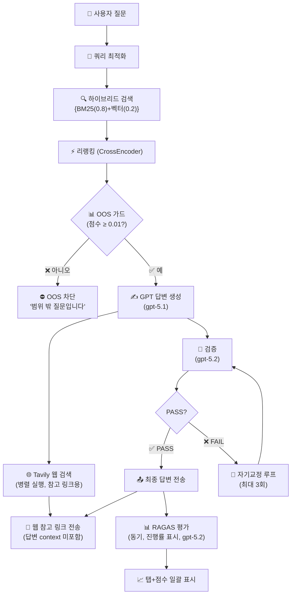
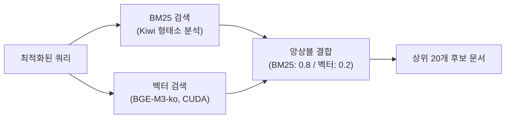
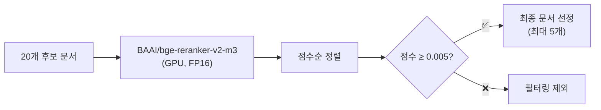
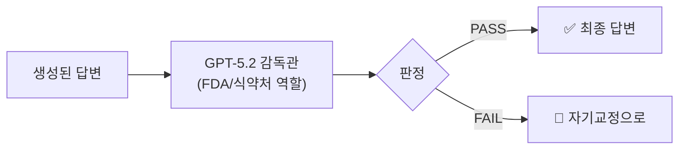
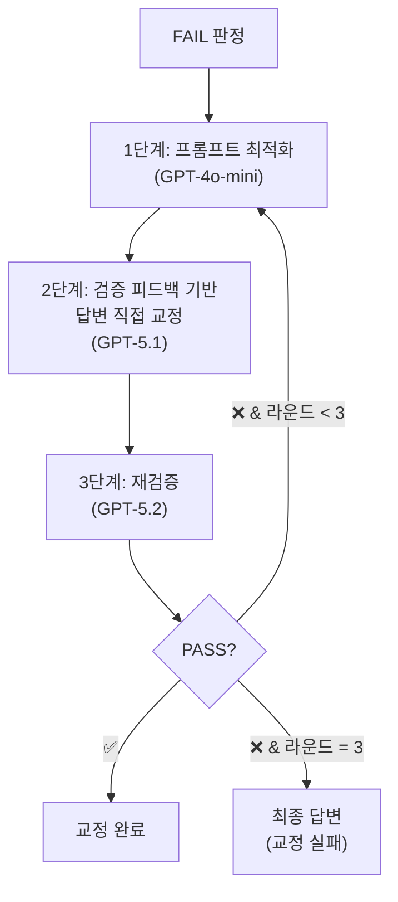
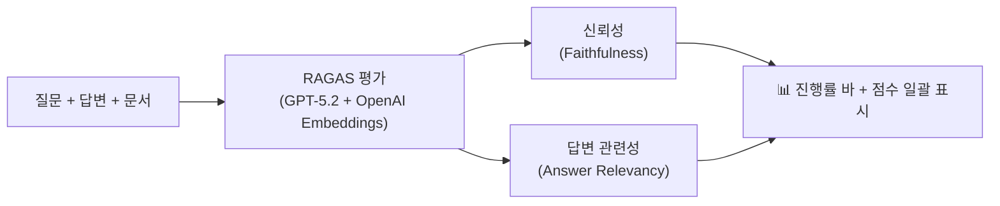
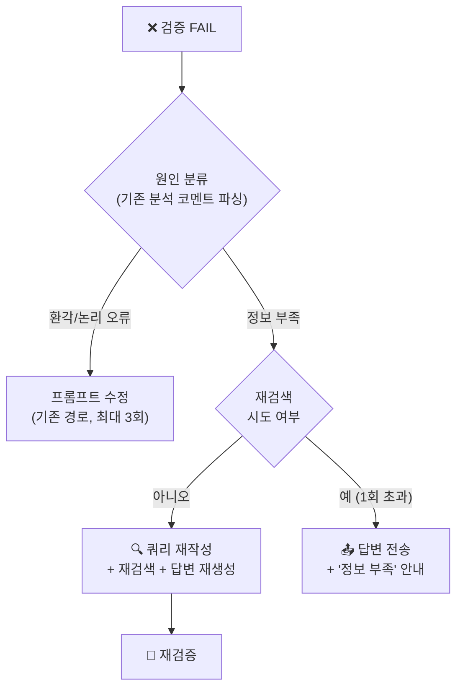

# 💊 약사 AI RAG 시스템 — 파이프라인 프로세스

## 시스템 개요

사용자 질문 → 검색 → 리랭킹 → 답변 생성 → 검증 → 자기교정 → RAGAS 성능 평가

---

## 1단계: 쿼리 최적화 (Query Optimization)

사용자의 자연어 질문을 **약학 검색에 최적화된 쿼리**로 변환합니다.

| 구성 요소        | 설명                                                          |
| ------------ | ----------------------------------------------------------- |
| **규칙 기반 확장** | 증상→성분 매핑 (두통→아세트아미노펜), 동의어 확장                               |
| **LLM 라우팅**  | GPT-4o-mini가 `core_terms`, `recall_terms`, `avoid_terms` 생성 |
| **리랭킹 쿼리**   | 비의학적 표현 제거 후 핵심 키워드만 추출                                     |

---

## 2단계: 하이브리드 검색 (Hybrid Search)

**BM25 (키워드)** + **벡터 검색 (의미)** 앙상블로 문서를 검색합니다.

| 검색 방식    | 모델                        | 가중치     | 강점         |
| -------- | ------------------------- | ------- | ---------- |
| **BM25** | Kiwi 한국어 형태소 분석           | **0.8** | 정확한 키워드 매칭 |
| **벡터**   | dragonkue/BGE-m3-ko (GPU) | 0.2     | 의미적 유사도    |

---

## 3단계: 리랭킹 (Reranking)

**CrossEncoder**로 후보 문서의 질문 관련도를 정밀 평가합니다.

> [!IMPORTANT]
> **최소 점수 임계값 (MIN_RERANK_SCORE = 0.005)**: 관련성 없는 문서를 컨텍스트에서 제거하여 답변 품질과 RAGAS 신뢰성을 높입니다.

---

## 4단계: OOS 가드 (Out-of-Scope Guard)

최상위 문서 점수가 임계값 미만이면 **GPT 호출 없이 즉시 차단**합니다.

| 조건                     | 임계값               | 결과   |
| ---------------------- | ----------------- | ---- |
| `top_score < 0.01`     | OOS_MIN_TOP_SCORE | ⛔ 차단 |
| `top_relevance < 0.55` | OOS_MIN_RELEVANCE | ⛔ 차단 |

**차단 예시**:

- "ㅋㅋㅋㅋㅋ" (점수 0.000) → ⛔ 즉시 차단
- "삼성전자 주가" (점수 0.003) → ⛔ 즉시 차단
- "눈에 도움되는 약" (점수 0.026) → ✅ 통과

---

## 5단계: 답변 생성 (Answer Generation)

**GPT-5.1**이 검색된 문서 기반으로 답변을 생성합니다 (스트리밍).

### 프롬프트 핵심 지침

| #   | 규칙                                       | RAGAS 영향      |
| --- | ---------------------------------------- | ------------- |
| 1   | 문서에 기재된 내용만 사용, 추측 금지                    | 신뢰성 ↑         |
| 2   | **사전 학습 지식·외부 웹 정보 사용 금지**               | 신뢰성 ↑         |
| 3   | 부작용 강도 임의 등급 금지                          | 신뢰성 ↑         |
| 4   | **단락 끝에 한 번만** [문서 N] 출처 표기 (클릭 시 모달 팝업) | 신뢰성 ↑ · 가독성 ↑ |
| 5   | "전문가와 꼭 상담하세요" 포함                        | 검증 PASS       |
| 6   | 관련 문서 내용 그대로 인용                          | 신뢰성 ↑         |
| 7   | 첫 문장에서 질문 핵심 키워드 반영                      | 관련성 ↑         |

---

## 5.5단계: 동적 웹 참조 (Dynamic Web Reference)

답변 생성과 **병렬**로 Tavily API를 통해 외부 웹 검색을 수행하고, **참고 링크만** 제공합니다.

```mermaid
flowchart LR
    subgraph 메인_파이프라인["🔒 메인 RAG 파이프라인"]
        A["검색된 문서\n(로컬 DB)"] --> B["GPT 답변 생성"]
        B --> C["검증 · 교정"]
    end

    subgraph 동적_참조["🌐 동적 참조 (병렬)"]
        D["사용자 질문"] --> E["Tavily API\n웹 검색"]
        E --> F["참고 링크만\n추출"]
    end

    C --> G["📤 최종 답변"]
    F --> H["🔗 웹 참고 탭\n(링크만 표시)"]

    style 메인_파이프라인 fill:#0f172a,stroke:#3b82f6,stroke-width:2px
    style 동적_참조 fill:#0f172a,stroke:#22c55e,stroke-width:1px,stroke-dasharray:5
```

> [!IMPORTANT]
> **핵심 원칙**: 웹 검색 결과는 답변 생성 context에 **절대 포함하지 않습니다**. RAGAS 신뢰성·검증 점수에 영향을 주지 않으면서, 사용자에게 추가 참고 자료를 제공합니다.

| 항목             | 설정                                  |
| -------------- | ----------------------------------- |
| **API**        | Tavily Search API                   |
| **실행 방식**      | 답변 생성과 **병렬** (asyncio.create_task) |
| **타임아웃**       | 5초 (초과 시 무시)                        |
| **최대 결과**      | 5건                                  |
| **context 혼입** | ❌ 없음 (링크만 별도 SSE 이벤트로 전송)           |
| **RAGAS 영향**   | ❌ 없음                                |
| **비용**         | 무료 1,000회/월 (tavily.com)            |

### 정적 참조 vs 동적 참조 비교

| 구분           | 정적 참조 (로컬 DB)   | 동적 참조 (Tavily)        |
| ------------ | --------------- | --------------------- |
| **데이터**      | 사전 임베딩된 28,651건 | 실시간 웹 검색              |
| **신뢰성**      | ✅ 검증된 약학 데이터    | ⚠️ 웹 데이터 (참고용)        |
| **용도**       | 답변 생성 context   | 참고 링크만 제공             |
| **속도**       | ~0.3-0.8초       | ~1-3초 (병렬이라 추가 지연 없음) |
| **RAGAS 영향** | 포함              | 미포함                   |

---

## 6단계: 검증 (Verification)

**GPT-5.2 검증관**이 답변의 논리적 타당성을 평가합니다.

### 판정 기준

| 판정       | 조건                              |
| -------- | ------------------------------- |
| **PASS** | 문서에서 합리적 유추 가능, 안전 권고 포함        |
| **FAIL** | 문서에 없는 내용 완전 날조 (Hallucination) |

> [!NOTE]
> 검증관은 문서에 직접적인 단어가 없더라도 **합리적 유추는 PASS**로 판정합니다. 오직 환각(Hallucination)만 FAIL 처리합니다.

---

## 7단계: 자기교정 루프 (Self-Correction Loop)

FAIL 판정 시 **최대 3회** 자동 교정을 시도합니다.

| 단계       | 모델          | 역할                     |
| -------- | ----------- | ---------------------- |
| 프롬프트 최적화 | GPT-4o-mini | 실패 원인 분석 → 개선된 프롬프트 생성 |
| 답변 교정    | GPT-5.1     | 검증 피드백 반영 → 수정된 답변 생성  |
| 재검증      | GPT-5.2     | 교정된 답변의 타당성 재평가        |

---

## 8단계: RAGAS 성능 평가 (동기, 진행률 표시)

검증 완료 후 **RAGAS 평가를 기다린 뒤** 탭+점수를 한 번에 표시합니다.

| 지표                   | 측정 방식                | 목표    |
| -------------------- | -------------------- | ----- |
| **Faithfulness**     | 답변의 모든 주장이 문서에서 나왔는가 | ≥ 0.8 |
| **Answer Relevancy** | 답변이 질문에 직접적으로 관련되는가  | ≥ 0.7 |

### RAGAS 평가 설정

| 항목    | 설정                                |
| ----- | --------------------------------- |
| LLM   | GPT-5.2                           |
| 임베딩   | OpenAI text-embedding-3-small     |
| 실행 방식 | **동기** (done 이전 대기, 5초 heartbeat) |
| 진행률   | 예상 ~80초 기준 0-95% → 완료 시 100%      |
| 문서 수  | 전체 (LLM과 동일)                      |
| 문서 길이 | 1000자 (LLM과 동일)                   |

> [!TIP]
> RAGAS 문맥을 LLM 컨텍스트와 동일하게 맞추는 것이 핵심입니다. 불일치 시 LLM이 인용한 문서 4-5의 정보를 RAGAS가 "문맥에 없다"고 판단하여 신뢰성이 급락합니다.

---

## 전체 모델 구성

| 역할          | 모델                       | 용도                |
| ----------- | ------------------------ | ----------------- |
| 쿼리 최적화      | GPT-4o-mini              | 검색어 확장, 리랭킹 쿼리 정제 |
| 답변 생성       | GPT-5.1                  | 스트리밍 답변 생성        |
| 검증          | GPT-5.2                  | 논리적 타당성 평가        |
| 자기교정        | GPT-4o-mini + GPT-5.1    | 프롬프트 최적화 + 답변 재생성 |
| RAGAS 평가    | GPT-5.2                  | 신뢰성/관련성 점수 계산     |
| 임베딩 (검색)    | BGE-m3-ko (GPU)          | 벡터 검색             |
| 임베딩 (RAGAS) | text-embedding-3-small   | 답변 관련성 평가         |
| 리랭커         | bge-reranker-v2-m3 (GPU) | 문서 정밀 순위 매김       |
| 웹 검색        | Tavily Search API        | 동적 참조 링크 제공       |

---

## 전체 타임라인 (일반적인 질문 기준)

```mermaid
gantt
    title 처리 시간 타임라인
    dateFormat X
    axisFormat %s초

    section 전처리
    쿼리 최적화 (GPT)     :a1, 0, 2

    section 검색
    하이브리드 검색        :a2, 2, 3
    리랭킹 (GPU)          :a3, 3, 4

    section 생성
    답변 생성 (스트리밍)    :a4, 4, 40
    웹 검색 (Tavily, 병렬) :a7, 4, 7

    section 검증
    GPT 검증              :a5, 40, 50

    section 평가
    RAGAS 평가 (동기, 진행률 표시) :crit, a6, 50, 130
```

| 단계          | 소요시간          | 비고                       |
| ----------- | ------------- | ------------------------ |
| 쿼리 최적화      | ~1-2초         | GPT-4o-mini              |
| 검색 + 리랭킹    | ~1-2초         | GPU 가속                   |
| 답변 생성       | ~30-40초       | 스트리밍 (TTFT ~1초)          |
| 웹 검색 (병렬)   | ~1-3초         | 답변 생성과 동시 실행             |
| 검증          | ~8-10초        | GPT-5.2                  |
| RAGAS (동기)  | ~60-80초       | 진행률 바 표시, 5초마다 heartbeat |
| **총 소요 시간** | **~110-130초** | 탭+점수 한 번에 표시             |

---

## 향후 개선 방향

### 검증 실패 원인 기반 분기 (Adaptive Re-Search)

현재 자기교정은 **프롬프트 최적화**만 수행하지만, 실패 원인이 **정보 부족(Retrieval Failure)**인 경우 프롬프트를 아무리 수정해도 효과가 없습니다.

| 시나리오 | 현재 | 개선 후 |
|---|---|---|
| 문서 있지만 검색 누락 | FAIL 반복 | ✅ 쿼리 재작성 → 검색 |
| DB에 정보 자체 없음 | FAIL 반복 | "정보 부족" 안내 |
| 환각 | 프롬프트 교정 | 동일 (기존 경로) |

> [!NOTE]
> 현재 하이브리드 검색(BM25+벡터) + 리랭킹이 충분히 커버하고 있어 **정보 부족으로 인한 FAIL은 매우 드뭅니다.** 운영 로그에서 해당 패턴이 빈번해지면 구현을 검토합니다.
