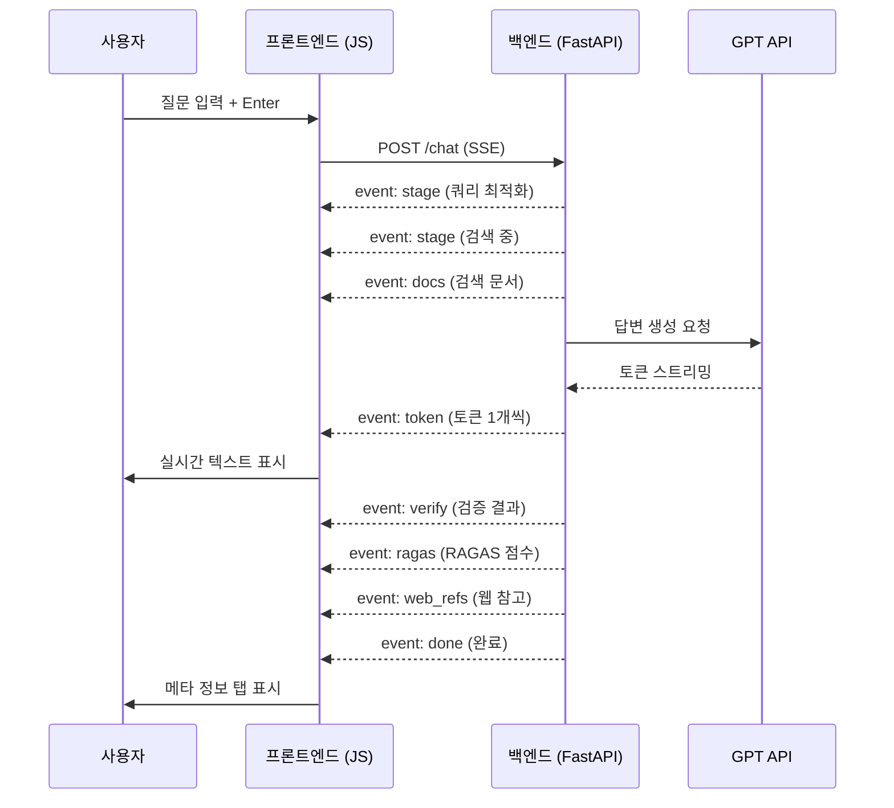

# 💊 약사 AI 챗봇 — UI 구성 설명서

> **버전**: v3.1 · **기술 스택**: HTML + Vanilla CSS + JavaScript · **백엔드 연동**: FastAPI SSE 스트리밍

---

## 📐 전체 아키텍처

```
┌──────────────────────────────────────────────────────────────┐
│                      🌐 브라우저                              │
│  ┌───────────┐  ┌──────────────────────────────────────────┐ │
│  │  Sidebar   │  │              Main Area                   │ │
│  │ (설정 패널) │  │  ┌──────────────────────────────────┐   │ │
│  │            │  │  │         Topbar (헤더)              │   │ │
│  │ • GPU 모니터│  │  ├──────────────────────────────────┤   │ │
│  │ • 모델 선택 │  │  │                                  │   │ │
│  │ • 검색 설정 │  │  │       Chat Area (채팅 영역)       │   │ │
│  │ • 고급 옵션 │  │  │      - Empty State (초기 화면)    │   │ │
│  │ • RAGAS 지표│  │  │      - Messages (대화 메시지)     │   │ │
│  │ • 예시 질문 │  │  │                                  │   │ │
│  │            │  │  ├──────────────────────────────────┤   │ │
│  │            │  │  │      Input Area (입력 영역)        │   │ │
│  └───────────┘  │  └──────────────────────────────────┘   │ │
│                  └──────────────────────────────────────────┘ │
│  ┌──────────────────────────────────────────────────────────┐ │
│  │          Overlays (오버레이: 로딩, 모달 등)               │ │
│  └──────────────────────────────────────────────────────────┘ │
└──────────────────────────────────────────────────────────────┘
```

---

## 📁 파일 구조

| 파일 | 역할 | 규모 |
|------|------|------|
| `index.html` | UI 레이아웃 및 HTML 구조 | 422줄 |
| `style_v31.css` | 다크 테마 UI 스타일링 | 2,512줄 |
| `app_v31.js` | 프론트엔드 로직 (SSE, 이벤트 핸들링) | 1,027줄 |
| `img/hero-pill.svg` | 메인 히어로 일러스트 (애니메이션 포함) | SVG |
| `img/feature-*.svg` | 기능 아이콘 (검색, 리랭킹, 검증, 교정) | SVG ×4 |

---

## 🎨 디자인 시스템

### 컬러 팔레트

| 용도 | CSS 변수 | 색상 |
|------|----------|------|
| 배경 (기본) | `--bg-primary` | `hsl(222, 47%, 5%)` 🔵 짙은 네이비 |
| 배경 (표면) | `--bg-surface` | `hsl(222, 40%, 8%)` |
| 강조 (파랑) | `--blue` | `#3b82f6` 🔵 |
| 강조 (보라) | `--purple` | `#8b5cf6` 🟣 |
| 강조 (초록) | `--green` | `#22c55e` 🟢 |
| 경고 (빨강) | `--red` | `#ef4444` 🔴 |
| 텍스트 (기본) | `--text-primary` | `hsl(210, 40%, 95%)` |
| 텍스트 (보조) | `--text-secondary` | `hsl(215, 20%, 65%)` |

### 타이포그래피

- **주 폰트**: `Inter` (영문) + `Pretendard` (한글)
- **Google Fonts** CDN 로드
- 폰트 두께: 300 ~ 800 (Light ~ Extra Bold)

### 시각 효과

| 효과 | 설명 |
|------|------|
| 글래스모피즘 | `backdrop-filter: blur()` + 반투명 배경 |
| 그라디언트 배경 | 3개의 `bg-blur` 구체가 부드럽게 부유 |
| 그리드 패턴 | `bg-grid`로 미세한 도트 그리드 오버레이 |
| 마이크로 애니메이션 | `cubic-bezier` 이징, 300ms 트랜지션 |
| AOS(Animate On Scroll) | `IntersectionObserver` 기반 등장 애니메이션 |

---

## 🧩 컴포넌트 상세

### 1️⃣ 초기화 오버레이 (`initOverlay`)

```
┌──────────────────────────┐
│         💊               │
│    약사 AI 준비 중         │
│  임베딩 모델 로드 중...     │
│  ┌──────────────────┐    │
│  │ ● 서버 연결 확인 중│    │
│  └──────────────────┘    │
│  BGE-M3 모델 로드 완료 ✓  │
│  ChromaDB 연결 완료 ✓    │
└──────────────────────────┘
```

- **역할**: 서버가 모델과 DB를 로드하는 동안 표시
- **동작**: `/health` 엔드포인트를 폴링하여 준비 상태 확인
- **UI**: 스피너 + 실시간 로그 메시지 표시
- 로드 완료 시 `fade-out` 애니메이션으로 사라짐

---

### 2️⃣ 사이드바 (`sidebar`)

사이드바는 6개의 섹션으로 구성됩니다.

#### 2-1. 로고 영역

```
💊 약사 AI  v3.1
   Pharmacist RAG Engine
```

#### 2-2. GPU(VRAM) 모니터 위젯

```
┌─────────────────────────┐
│ 🟢 RTX 4060 Ti          │
│ ██████████░░░░░  67%     │
│ 5.2 GB / 8.0 GB         │
│ * 약 2GB는 기본 점유량    │
└─────────────────────────┘
```

- **실시간 모니터링**: `setInterval(pollVRAM, 3000)` — 3초마다 폴링
- **색상 변화**: 사용률에 따라 🟢 → 🟡 → 🔴 동적 변경
- **메모리 정리 버튼** 🗑️: `/clear_memory` API 호출

#### 2-3. GPT 모델 선택

```
┌─────────────────────────┐
│ ⚙ GPT 모델              │
│ ┌─────────────────────┐ │
│ │ GPT-5.1 (답변 생성) ▼│ │
│ └─────────────────────┘ │
│ 옵션: GPT-5.2 (고정밀)  │
│       GPT-5.0 (경량)    │
│       GPT-4o            │
└─────────────────────────┘
```

#### 2-4. 앙상블 검색 가중치

```
┌─────────────────────────────┐
│ 🔍 앙상블 가중치              │
│ BM25  ═══════════●══  0.80  │
│ 벡터  ██░░░░░░░░░░░  0.20   │
└─────────────────────────────┘
```

- **BM25 슬라이더**: 0~100 범위 (기본값: 80)
- **벡터 가중치**: `1 - BM25`로 자동 계산되어 표시
- 프로그레스 바로 시각적 비율 표현

#### 2-5. Top-K 문서 수

```
┌─────────────────────────┐
│ 📋 Top-K 문서 수         │
│   ══════●═══   5        │
│   (범위: 3 ~ 10)         │
└─────────────────────────┘
```

#### 2-6. 고급 옵션 — 자기 교정 루프

```
┌─────────────────────────┐
│ 🔄 자기 교정 루프     [●]│
│    FAIL 시 최대 3회 재시도│
└─────────────────────────┘
```

#### 2-7. RAGAS 성능 지표

```
┌──────────────────────────────┐
│ 📊 최근 RAG 성능 지표         │
│ 신뢰성 (Faithfulness)   0.85 │
│ ████████████████░░░░         │
│ 답변 관련성 (Relevancy) 0.92 │
│ ██████████████████░░         │
└──────────────────────────────┘
```

- 프로그레스 바로 점수 시각화 (0.0 ~ 1.0)
- 매 응답 후 RAGAS 평가 결과로 실시간 업데이트

#### 2-8. 예시 질문

```
┌────────────────────────────────┐
│ ❓ 예시 질문                    │
│ ┌─────────────────────────┐   │
│ │ 타이레놀과 애드빌 같이 먹어도│   │
│ │ 되나요?                  │   │
│ └─────────────────────────┘   │
│ ┌─────────────────────────┐   │
│ │ 혈압약 복용 중인데 감기약 │   │
│ │ 뭐 먹어도 될까요?        │   │
│ └─────────────────────────┘   │
└────────────────────────────────┘
```

- 클릭 시 해당 질문이 자동으로 입력되어 전송

---

### 3️⃣ 메인 영역 (`main`)

#### 3-1. 상단 바 (Topbar)

```
┌──────────────────────────────────────────────────┐
│ ☰  💊 약사 AI 챗봇  실시간 근거 기반 답변          │
│                    [BGE-M3-ko] [BM25+벡터] [CE]  │
└──────────────────────────────────────────────────┘
```

- **햄버거 메뉴** ☰: 모바일에서 사이드바 토글
- **뱃지 3종**: 사용 중인 기술 스택 표시
  - 🟢 `BGE-M3-ko` — 한국어 임베딩 모델
  - 🔵 `BM25+벡터` — 하이브리드 검색
  - 🟣 `CrossEncoder` — 리랭킹 모델

#### 3-2. 빈 상태 (Empty State) — 초기 화면

```
┌──────────────────────────────────────────┐
│              [💊 SVG 일러스트]            │
│                                          │
│       약사 AI에게 물어보세요               │
│   외부 의약품 데이터베이스 기반 RAG 시스템  │
│     근거 중심 · 출처 표기 · 자기 검증      │
│                                          │
│ ← 📚 출처기반   🛡️ 자기검증   ⚕️ 약학특화→│
│           (마르키 무한 스크롤)             │
│                                          │
│  ┌────────┐┌────────┐┌────────┐┌───────┐│
│  │앙상블검색││리랭킹  ││GPT검증 ││자기교정││
│  │BM25+RRF ││정밀정렬 ││PASS/FAIL││3회재시도│
│  └────────┘└────────┘└────────┘└───────┘│
└──────────────────────────────────────────┘
```

- **히어로 SVG**: 알약 캡슐 + 궤도 애니메이션 (자동 회전)
- **마르키 (Trust Strip)**: 핵심 기능 문구가 무한 스크롤
- **Feature Chips**: 4개의 핵심 기능 카드 (SVG 아이콘 포함)

#### 3-3. 채팅 메시지 영역

```
┌──────────────────────────────────────┐
│ 나  눈이 침침한데 뭐 먹으면 될까요?   │
│                                      │
│ AI  눈 건강에 도움이 되는 건강기능     │
│     식품을 안내해 드리겠습니다...      │
│     ✅ PASS  Faithfulness: 0.92      │
│     ┌────────────────────────────┐   │
│     │📄 참고문서│📊 성능│🔄 교정│🌐웹│   │
│     ├────────────────────────────┤   │
│     │ #1 루테인 (0.847)           │   │
│     │ #2 오메가3 (0.723)          │   │
│     │ #3 비타민A (0.651)          │   │
│     └────────────────────────────┘   │
└──────────────────────────────────────┘
```

**사용자 메시지** (`msg-user`):
- 우측 정렬
- 파란색 그라디언트 배경
- 아바타: "나"

**AI 메시지** (`msg-ai`):
- 좌측 정렬
- 다크 배경 + 글래스 효과
- 아바타: "AI"
- 실시간 스트리밍 시 Markdown 렌더링
- 답변 완료 후 메타 정보 패널 표시

**AI 메시지 하단 탭 (4개)**:

| 탭 | 내용 |
|---|---|
| 📄 **참고 문서** | 검색된 문서 목록 (순위, 점수, 클릭 시 모달) |
| 📊 **성능 지표** | 응답 시간, 토큰 수, RAGAS 점수 |
| 🔄 **교정 로그** | 자기 교정 루프 진행 과정 (라운드별) |
| 🌐 **웹 참고** | Tavily 웹 검색 결과 외부 링크 |

#### 3-4. 입력 영역

```
┌──────────────────────────────────────────┐
│ ☐ 📝 긴 답변                             │
│ ┌──────────────────────────────────┐ ┌─┐│
│ │ 약에 대해 궁금한 것을 물어보세요…  │ │▶││
│ └──────────────────────────────────┘ └─┘│
│ Enter로 전송 · Shift+Enter로 줄바꿈      │
└──────────────────────────────────────────┘
```

- **자동 높이 조절** (`autoResize`): 텍스트에 맞춰 입력창 높이 변경
- **긴 답변 체크박스**: 체크 시 더 상세한 응답 생성
- **전송/중지 버튼**: 스트리밍 중 ■(정지) 버튼으로 변경
- **플레이스홀더 회전**: 5초마다 예시 문구 자동 전환

---

### 4️⃣ 문서 미리보기 모달 (`docModal`)

```
┌────────────────────────────────────┐
│ #1  루테인의 효능과 안전성      ✕  │
│ 점수: 0.847  |  출처: MFDS        │
│ ──────────────────────────────── │
│ 루테인은 눈 건강에 도움을 주는     │
│ 건강기능식품 원료입니다...          │
│                                    │
│ [전체 문서 내용 표시]               │
└────────────────────────────────────┘
```

- 참고 문서 클릭 시 팝업
- ESC 키 또는 외부 클릭으로 닫기
- 순위, 점수, 출처, 전체 본문 표시

---

### 5️⃣ 작업 준비 오버레이 (`metricsOverlay`)

```
┌──────────────────────┐
│       💊 (회전)       │
│ 잠시만 기다려주세요 💙 │
│ 작업을 준비하고 있어요 │
└──────────────────────┘
```

- 검증/RAGAS 평가 등 후처리 단계에서 표시
- 반투명 오버레이 + 알약 아이콘 회전 애니메이션

---

## ⚡ 핵심 JavaScript 기능

### SSE 스트리밍 흐름



### 주요 함수

| 함수 | 역할 |
|------|------|
| `sendMessage()` | 사용자 입력을 서버에 전송하고 SSE 스트림 시작 |
| `handleSSE(type, payload, state)` | SSE 이벤트별 UI 업데이트 (토큰, 문서, 검증 등) |
| `renderMarkdown(text)` | 마크다운 → HTML 변환 (코드블록, 볼드, 리스트 등) |
| `pollVRAM()` | 3초마다 GPU 사용량 폴링 + UI 업데이트 |
| `renderDocs(panel, docs)` | 참고 문서 목록 렌더링 |
| `renderPerf(panel, metrics, verify, ragas)` | 성능 지표 탭 구성 |
| `renderLog(panel, logs, isPass)` | 교정 루프 로그 렌더링 (접기/펼치기) |
| `renderWebRefs(panel, refs)` | 웹 참고 링크 렌더링 |
| `appendUserMsg(text)` | 사용자 메시지 DOM 추가 |
| `appendAiMsg()` | AI 메시지 DOM 추가 (실시간 업데이트용 참조 반환) |
| `buildExamplePills()` | 랜덤 예시 질문 3개 생성 |
| `autoResize()` | 텍스트 입력 영역 자동 높이 조절 |
| `toggleSidebar()` | 모바일 사이드바 열기/닫기 |

---

## 📱 반응형 디자인

| 화면 크기 | 동작 |
|----------|------|
| **데스크탑** (≥ 768px) | 사이드바 항상 표시, 채팅 영역과 나란히 배치 |
| **모바일** (< 768px) | 사이드바 숨김, 햄버거 메뉴로 토글, 전체 화면 채팅 |

---

## 🔗 프론트엔드 ↔ 백엔드 통신

| 엔드포인트 | 메서드 | 역할 |
|-----------|--------|------|
| `POST /chat` | SSE | 질문 전송 + 실시간 응답 스트리밍 |
| `GET /health` | JSON | 서버/모델 상태 확인 (초기 로딩용) |
| `POST /clear_memory` | JSON | GPU 메모리 캐시 해제 |

### `/chat` 요청 파라미터

```json
{
  "query": "눈이 침침한데 뭐 먹으면 될까요?",
  "model": "gpt-5.1",
  "top_k": 5,
  "ensemble_k": 20,
  "weight_bm25": 0.8,
  "use_self_correction": true,
  "long_answer": false
}
```

### SSE 이벤트 종류

| event 이름 | 데이터 | 설명 |
|-----------|--------|------|
| `stage` | `{stage, message}` | 현재 처리 단계 표시 |
| `token` | `{token}` | 생성된 텍스트 토큰 (1개씩) |
| `docs` | `{docs: [...]}` | 검색된 참고 문서 목록 |
| `verify` | `{result, raw}` | 검증 결과 (PASS/FAIL) |
| `ragas` | `{faithfulness, relevancy}` | RAGAS 평가 점수 |
| `correction_log` | `{logs: [...]}` | 자기 교정 히스토리 |
| `web_refs` | `{refs: [...]}` | 웹 검색 참고 링크 |
| `metrics` | `{total_time, tokens, ...}` | 성능 메트릭 |
| `done` | `{}` | 스트리밍 완료 |
| `error` | `{message}` | 에러 메시지 |

---

## 🎯 UX 특징 요약

| 특징 | 구현 방식 |
|------|----------|
| **실시간 스트리밍** | SSE로 토큰 단위 표시, 타이핑 효과 |
| **근거 투명성** | 참고 문서 + 검증 결과 + RAGAS 점수 공개 |
| **GPU 모니터링** | 실시간 VRAM 게이지 + 메모리 정리 기능 |
| **프리미엄 다크 UI** | 글래스모피즘 + 그라디언트 + 미세 애니메이션 |
| **접근성** | `aria-label`, `aria-live`, 키보드 단축키 |
| **모바일 대응** | 반응형 레이아웃, 터치 최적화 |
